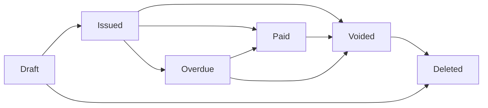

## Invoice States

The Contazen API manages invoices through several distinct states, each serving a specific purpose in the invoice lifecycle.

### State Overview

| Status | Description | Can Edit | Can Void | Can Delete | API Visible |
|--------|-------------|----------|----------|------------|-------------|
| `draft` | Invoice not finalized | ✅ Yes | ❌ No | ✅ Yes | ✅ Yes |
| `issued` | Active unpaid invoice | ❌ No | ✅ Yes | ❌ No | ✅ Yes |
| `paid` | Fully paid invoice | ❌ No | ✅ Yes | ❌ No | ✅ Yes |
| `overdue` | Past due date | ❌ No | ✅ Yes | ❌ No | ✅ Yes |
| `voided` | Cancelled invoice | ❌ No | ❌ No | ✅ Conditional* | ✅ Yes |
| (deleted) | Removed from DB | N/A | N/A | N/A | ❌ No (404) |

*Voided invoices can only be deleted if they are the last in their series

## State Transitions



## Key Concepts

### Draft Invoices
- Created but not finalized
- Can be edited freely
- No invoice number assigned
- Can be deleted without voiding

### Active Invoices
- Have been issued with an invoice number
- Cannot be edited (immutable for compliance)
- Can transition to paid, overdue, or voided states
- Must be voided before deletion

### Voided Invoices
- Marked as cancelled but retained for audit trail
- Remain visible in API with `status: "voided"`
- Cannot be edited or reactivated
- Can only be deleted if last in series (sequential numbering requirement)

### Deleted Invoices
- Completely removed from database
- Return 404 errors on all API calls
- Cannot be recovered
- Only drafts and voided invoices can be deleted

## API Response Fields

When retrieving invoices, these fields indicate the current state:

```json
{
  "status": "issued",        // Current status (draft/issued/paid/overdue/voided)
  "is_draft": false,         // true if draft
  "is_paid": false,          // true if fully paid
  "is_voided": false,        // true if voided/cancelled
  "document_type": "fiscal", // Type of invoice
  "number": "CTZ-2024-001"   // Invoice number (null for drafts)
}
```

## Best Practices

### For Compliance
1. **Never delete active invoices** - Always void first to maintain audit trail
2. **Preserve sequential numbering** - Only delete the last voided invoice in a series
3. **Keep voided invoices** - Consider not deleting voided invoices for complete audit history

### For Integration
1. **Check status field** - Primary indicator of invoice state
2. **Handle voided invoices** - They appear in lists but with voided status
3. **Expect 404 for deleted** - Deleted invoices are gone permanently
4. **Use appropriate filters** - Filter by status to get specific invoice states

## Common Workflows

### Cancel an Invoice
```bash
# 1. Void the invoice
POST /api/v1/invoices/{id}/void

# 2. Optionally delete if last in series
DELETE /api/v1/invoices/{id}
```

### List Active Invoices Only
```bash
# Get issued unpaid invoices (excludes voided)
GET /api/v1/invoices?status=issued

# Get all non-voided invoices
GET /api/v1/invoices?is_paid=0
GET /api/v1/invoices?is_paid=1
```

### List All Including Voided
```bash
# Default behavior includes voided invoices
GET /api/v1/invoices

# Filter for only voided invoices
GET /api/v1/invoices?status=voided
```

## Romanian Fiscal Requirements

The API enforces Romanian fiscal regulations:

- **Sequential Numbering**: Invoice numbers must be sequential without gaps
- **Immutable Records**: Issued invoices cannot be modified
- **Audit Trail**: Voided invoices are retained for compliance
- **E-Factura Integration**: Submitted invoices have additional restrictions

<Note>
  The distinction between voided and deleted is crucial for compliance. Voided invoices maintain the audit trail while deleted invoices are permanently removed.
</Note>